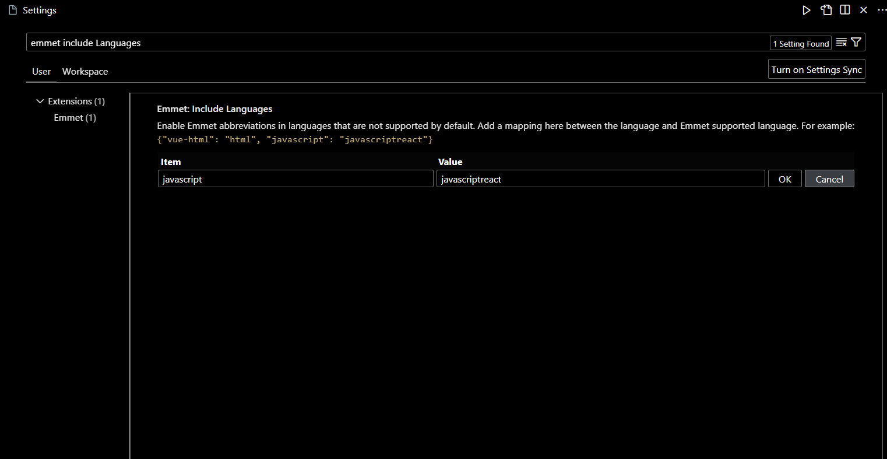

# 🎓 Vite Js  + React 

## 📌 VS Code Setting end Dependency

- Open vs code setting end search `emmet include languages`

**Add language :**

| item       | Value           |
| :--------- | :-------------- |
| javascript | javascriptreact |

**OK**



## 📌 Install Vite + React

```bash
npm create vite@latest
```

or

```bash
npm create vite
```

- Enter your project name.
- Select react
- Select JavaScript Only

```bash
cd myProject
```

```bash
npm install
```

---

---

**Open vs code in this directory**

```bash
PS C:\Users\Desktop\myProject> code .
```

- **folder structure :**


- `public` : public directory for show publicly show.
- `src` : the _src_ is source directory. this not show publicly.
- `main.jsx` : This file is return all components.
- `App.jsx` : write here hello world.
- `package.json` & `package-lock.json` : **Warning** do not change anything in this file end do not delete this file. this files handle all dependence's end all packages.

**Remove File's end folder :**

- `App.css`
- `index.css`
- `/assets` : `react.svg`
- `/public` : `vite.svg`

**⚠️ Throw Error :** `src/main.jsx` remove line

```js
import "./main.jsx";
```

---

---

---

📝 **Note :**

Create Components name always capital latter (`Home.jsx`, `About.jsx`, `Service.js`)

---

## 📌 Start project developer mode.

```bash
npm run dev
```

## 📌 Write Hello World

- open `app.jsx` end remove all code.

```js
export default function App() {
  return (
    <div>
      <h2>Hello World</h2>
    </div>
  );
}
```

## 📌 CSS

#### 🔺 Global CSS

`app.js` :

```js
import "./styles/global.css";

export default function App() {
  return (
    <div>
      <h2>Hello World</h2>
    </div>
  );
}
```

- create new directory `src/styles/global.css`

```css
h2 {
  color: red;
}
```

This css apply all component's.

#### 🔺 Component CSS

**_`src/pages/home/Home.jsx`_**

```js
export default function Home() {
  return (
    <div>
      <h2 style={styles.theme}>Hello World</h2>
    </div>
  );
}

const styles = {
  name: "Hello World",
  theme: {
    backgroundColor: "red",
    color: "white",
    fontSize: "36px",
  },
};
```

**Also use like this.**

```js
export default function Home() {
  return (
    <div>
      <h2>{person.name}</h2>
    </div>
  );
}

const person = {
  name: "John Doe",
};
```

#### 🔺 Local CSS

```js
import Local from "./Local.module.css";
```

import specific component css.

```js
import React from "react";
import Local from "./Local.module.css";

export default function LocalCss() {
  return (
    <div className={Local.parent}>
      <h1 className={Local.myHeading}>Hello World</h1>
    </div>
  );
}
```

- Create `myLocalStyle.module.css` file name.

```css
.parent {
  background-color: red;
}

.myHeading {
  font-size: 35px;
  font-weight: bolder;
  color: white;
}
```

#### 🔺 inline css

```js
export default function Home() {
  return (
    <div style={{ color: "red", backgroundColor: "white", padding: 12, fontSize: "20px" }}>Hello World!</div>
  )
}
```

## 📌 image import

```js
// import images
import myImage from "../assets/Code_blxikb.jpg"

export default function Home() {
  // Using variable
  const imageWidth = 400

  return (
    <div>
      
    </div>
  )
}
```

## 📌 How to using react icons.

- install react-icons

```bash
npm i react-icons
```

- https://react-icons.github.io/react-icons

Import the icons you want to use: After installing the library, you can import specific icons into your component.

```js
import { BiSolidUserCircle, BiBell } from "react-icons/bi"
import { SiPubg } from "react-icons/si"

export default function Home() {  
  return (
    <div>      
      <div>
        <div>
          <BiSolidUserCircle />
        </div>
        <div>
          <BiBell style={{ color: "blue" }} />
        </div>

        <div>
          <SiPubg className="gameIcon" />
        </div>
      </div>

    </div>
  )
}
```

## 📌 Routing

- Install package

```bash
PS C:\Users\Desktop\myProject> npm i react-router-dom
```

- create components for navigation page.

export all this components. end import inside all components for using navigation.

**Home.jsx**

```js
function Home() {
  return <h1>This is a Home</h1>;
}

export default Home;
```

**About.jsx**

```js
function About() {
  return <h2>This is a About Page</h2>;
}

export default About;
```

**Service.jsx**

```js
function Service() {
  return <h2>This is a Service page.</h2>;
}

export default Service;
```

- Remove all code in App.jsx.
- import `BrowserRouter`, `Routes`, `Route`

**App.jsx**

```js
import { BrowserRouter, Routes, Route } from "react-router-dom";
import Home from "./Components/Home";
import Navigation from "./Navigation";
import About from "./Components/About";
import Service from "./Components/Service";

function App() {
  return (
    <BrowserRouter>
      <Navigation />
      <Routes>
        <Route path="/" element={<Home />} />
        <Route path="About" element={<About />} />
        <Route path="Service" element={<Service />} />
      </Routes>
    </BrowserRouter>
  );
}

export default App;
```

- create `navigation.jsx` for navigation without reload page.

- Do not use `<a href=""></a>`. use `<NavLink></NavLink>`.

```js
import { NavLink } from "react-router-dom";

function Navigation() {
  return (
    <nav>
      <ul>
        <li>
          <NavLink to={"/"}>Home</NavLink>
        </li>
        <li>
          <NavLink to={"About"}>About</NavLink>
        </li>
        <li>
          <NavLink to={"Service"}>Service</NavLink>
        </li>
      </ul>
    </nav>
  );
}

export default Navigation;
```

#### 🔺 Outlet

For nesting Route

**`App.jsx`**

```js
import { BrowserRouter, Routes, Route } from "react-router-dom"
import Home from "./Components/Home"
import Service from "./Components/Service"
import About from "./Components/About"
import Contact from "./Components/Contact"
import Navigation from "./Modules/Navigation"

export default function App() {
  return (
    <BrowserRouter>
      <Navigation />
      <Routes>

        <Route path="/" element={<Home />}>
          <Route path="Service" element={<Service />} />
          <Route path="About" element={<About />} />
        </Route>

        <Route path="Contact" element={<Contact />} />
      </Routes>
    </BrowserRouter>
  )
}
```

**`Navigation.jsx`**

```js
import { NavLink } from "react-router-dom";

export default function Navigation() {
  return (
    <nav>
      <ul>

        <li><NavLink to={'/'}>Home</NavLink>
          <ul>
            <li><NavLink to={'About'}>About</NavLink></li>
            <li><NavLink to={'Service'}>Service</NavLink></li>
          </ul>
        </li>

        <li><NavLink to={'Contact'}>Contact</NavLink></li>
      </ul>
    </nav>
  )
}
```

- This is a basic example of how to use the `<Outlet>` component in React Router v6 for nested routing. You can expand on this structure to create more complex routing scenarios for your application.

**`Home.jsx`**

```js
import { Outlet } from "react-router";

export default function Home() {
  return (
    <div>
      <h1>Home</h1>
      <Outlet />
    </div>
  )
}
```

**`About.jsx`**

```js
export default function About() {
  return <h1>About</h1>
}
```

**`Service.jsx`**

```js
export default function Service() {
  return <h1>Service</h1>
}
```

**`Contact.jsx`**

```js
export default function Contact() {
  return <h1>Contact</h1>
}
```

#### 🔺 Page Navigation using nesting router with outlet

**`App.jsx`**

```js
import { BrowserRouter, Routes, Route, NavLink } from 'react-router-dom'
import Home from './Components/Home'
import About from './Components/About'
import Service from './Components/Service'
import Contact from './Components/Contact'

export default function App() {

  return (
    <BrowserRouter>
      <Navigation />
      <Routes>
        <Route path='/' element={<Home />} />
        {/*  */}
        <Route path='About' element={<About />}>
          <Route index element={<Service />} />
          <Route path='Contact' element={<Contact />} />
        </Route>
        {/*  */}
      </Routes>
    </BrowserRouter>
  )
}

function Navigation() {
  return (
    <nav>
      <ul>
        <li><NavLink to={'/'}>Home</NavLink></li>
        <li><NavLink to={'About'}>About</NavLink></li>
      </ul>
    </nav>
  )
}
```

**`About.jsx`**

```js
import { NavLink, Outlet } from "react-router-dom"

export default function About() {
  return (
    <>
      <h1>This is a About page</h1>
      <PageNavigation />
      <Outlet />
    </>
  )
}

function PageNavigation() {
  return (
    <nav>
      <ul>
        <li><NavLink to={'/About'}>Service</NavLink></li>
        <li><NavLink to={'Contact'}>Contact</NavLink></li>                
      </ul>
    </nav>
  )
}
```

**`Service.jsx`**

```js
export default function Service() {
  return <h1>This is a Service Page</h1>    
}
```

**`Contact.jsx`**

```js
export default function Contact() {
  return <h1>This is a Contact page</h1>
}
```

## 📌 What is a Hook?

Hooks allow us to "hook" into React features such as state and lifecycle methods.

```js
import { useState } from "react";

export default function App() {
  const [color, setColor] = useState("Not Selected");

  return (
    <>
      <h2>My Favorite Color is {color}</h2>

      <button onClick={() => setColor("red")}>Click</button>
      <button onClick={() => setColor("green")}>Click</button>
      <button onClick={() => setColor("yellow")}>Click</button>
      <button onClick={() => setColor("blue")}>Click</button>
    </>
  );
}
```

You must `import` Hooks from `react`.

Here we are using the `useState` Hook to keep track of the application state.

State generally refers to application data or properties that need to be tracked.

#### 🔺 Hook Rules

There are 3 rules for hooks:

- Hooks can only be called inside React function components.

- Hooks can only be called at the top level of a component.

- Hooks cannot be conditional

## 📌 useState

#### 🔺 Create Counter using useState()

-  `useState` is a hook in React that allows you to add state to functional components. It takes an initial state as an argument and returns an array with two elements: the current state and a function to update the state. Here's an example of how to use `useState` in a React component:

```js
import { useState } from "react"

export default function UseContextComponent() {
  const [val, setVal] = useState(0)

  const increment = () => {
    setVal(() => val + 1)
  }

  const decrement = () => {
    setVal(() => val === 0 ? 0 : val - 1)
  }

  return (
    <section className="flexContainer">
      <button onClick={decrement}>-</button>
      <h1>{val}</h1>
      <button onClick={increment}>+</button>
    </section>
  )
}
```

- In this example, we import `useState` from React, declare a state variable called `val` with an initial value of 0, and define two event handlers, `increment` and `decrement`. These event handlers use the `setVal` function to update the count state when the "Increment" or "Decrement" buttons are clicked.

- The current value of `val` is displayed in the `<h1>` element, and clicking the buttons will update the value, causing the component to re-render and reflect the updated state.

#### 🔺 Change toggleTheme using useState()

- You can use `useState` to implement a simple theme toggler in a React component. Here's an example of how to create a button that toggles between a light and dark theme:

```js
import React, { useState } from 'react'

export default function ToggleThemeContent() {
  const [theme, setTheme] = useState(false)

  const toggleTheme = () => {
    setTheme(!theme)
  }

  const themeClass = theme ? 'light' : 'dark'

  return (
    <section className={themeClass}>
      <h1>Hello React</h1>
      <p>Lorem ipsum dolor, sit amet consectetur adipisicing elit. Dolorum, quidem!</p>
      <p>Lorem ipsum, dolor sit amet consectetur adipisicing elit. Rerum earum dignissimos voluptas suscipit, quaerat odit id quibusdam. Repellat delectus, nesciunt veritatis eius rerum similique itaque, iure, a ad corrupti ratione.</p>

      <button onClick={toggleTheme}>Change Theme</button>
    </section>
  )
}
```

```css
.dark {
  background-color: black;
  color: white;
  padding: 10px;
}

.light {
  background-color: white;
  color: black;
  padding: 10px;
}
```

- In this example, we start by defining a state variable `theme` with an initial value of `false`. We also create a `toggleTheme` function that toggles the value of `theme` when the "Toggle Theme" button is clicked.

- The CSS class for the theme is determined by the `themeClass` variable, which is either "dark-theme" or "light-theme" based on the value of `theme`. You can define your CSS classes for the light and dark themes in your stylesheet.

- When the button is clicked, the theme will toggle between light and dark, and the component will re-render with the updated theme, thanks to the use of `useState`.

#### 🔺 Crete todo list using useState()

- Sure, here's another example of how to use `useState` in a React component to manage and update a list of items. In this example, we'll create a simple to-do list:

```js
import { useState } from "react"

export default function MyTodoList() {
  const [todo, setTodo] = useState([])
  const [inputVal, setInputVal] = useState('')

  const addTodo = () => {
    if (inputVal) {
      setTodo([...todo, inputVal])
      setInputVal('')
    }
  }

  const deleteTodo = (index) => {
    const updatedTodo = [...todo]
    updatedTodo.splice(index, 1)
    setTodo(updatedTodo)
  }

  return (
    <section>
      <h1>Todo List</h1>

      <input type="text" placeholder="Add Todo List" value={inputVal} onChange={(e) => setInputVal(e.target.value)} />
      <button onClick={addTodo}>Add Todo</button>

      <ul>
        {todo.map((t, i) => (
          <li key={i}>
            {t}
            <button onClick={() => deleteTodo(i)}>Delete</button>
          </li>
        ))}
      </ul>
    </section>
  )
}
```

**1.** We use `useState` to manage two state variables: `todo` and `inputVal`. `todo` is an array that holds the list of to-do items, and `inputVal` is a string that stores the current value of the input field.

**2.** The `addTodo` function is called when the "Add" button is clicked. It adds the value of `inputVal` to the `todo` array and then clears the input field.

**3.** The `deleteTodo` function allows you to remove a to-do item from the list by clicking the "Delete" button associated with each item.

**4.** The to-do items are displayed in an unordered list (`<ul>`) and rendered using the `map` function, which iterates over the `todo` array and generates a list item for each to-do item.

This example demonstrates how `useState` can be used to manage and update a dynamic list of items within a React component.

## 📌 useEffect()

#### 🔺 fetch API using useEffect()

- `useEffect` is a hook in React that allows you to perform side effects in your functional components. Side effects can include data fetching, DOM manipulation, or subscribing to external services. Here's an example of how to use `useEffect` in a React component:

```js
import { useState, useEffect } from 'react';

export default function UseEffect() {
  const [data, setData] = useState([]);
  const [loading, setLoading] = useState(true);

  useEffect(() => {

    fetch('https://res.cloudinary.com/dpiiduvvx/raw/upload/v1697829682/productData').then((response) => response.json()).then((data) => {
      console.log(data);
      const allData = [...data.earbud, ...data.tshirt, ...data.shoes, ...data.tshirtWomen,]
      setData(allData);
      setLoading(false);
    });

  }, []);

  return (
    <div>
      <h1>Example Component</h1>
      {loading ? (
        <p>Loading...</p>
      ) : (
        <ul>
          {data.map((item) => (
            <li key={item.id} style={styles.list}>{item.title}</li>
          ))}
        </ul>
      )}
    </div>
  );
}

const styles = {
  list: {
    margin: "10px 0",
    padding: "5px",
    listStyle: "none",
    backgroundColor: "#303030"
  }
}
```

#### 🔺 timing increment value using useEffect()

- In React, the `useEffect` hook is used to perform side effects in functional components. These side effects can include data fetching, setting up subscriptions, or manually changing the DOM in some way. It is similar to lifecycle methods in class components. Here's an example of how to use the `useEffect` hook in a React component:

```js
import { useEffect, useState } from "react"

export default function UseEffect() {
  const [count, setCount] = useState(0)

  useEffect(() => {
    document.title = `Count: ${count}`

    return () => {
      document.title = 'React App'
    }
  })

  const incrementCount = () => {
    setCount(count + 1)
  }

  return (
    <>
      <h1>Count: {count}</h1>
      <button onClick={incrementCount}>Increment</button>
    </>
  )
}
```

The `useEffect` Hook allows you to perform side effects in your components.

Some examples of side effects are: fetching data, directly updating the DOM, and timers.

`useEffect` accepts two arguments. The second argument is optional.

`useEffect(<function>, <dependency>)`

Use `setTimeout()` to count 1 second after initial render:

```js
import { useEffect, useState } from "react";

export default function App() {
  const [count, setCount] = useState(0);

  useEffect(() => {
    setTimeout(() => {
      setCount((count) => count + 1);
    }, 1000);
  });

  return (
    <>
      <h1>I have rendered {count} times!</h1>
    </>
  );
}
```

But wait!! It keeps counting even though it should only count once!

`useEffect` runs on every render. That means that when the count changes, a render happens, which then triggers another effect.

This is not what we want. There are several ways to control when side effects run.

We should always include the second parameter which accepts an array. We can optionally pass dependencies to `useEffect` in this array.

**1. No dependency passed:**

```js
useEffect(() => {
  // Runs on every render
});
```

**2. An empty array:**

```js
useEffect(() => {
  // Runs only on the first render
}, []);
```

**Props or state values**

```js
useEffect(() => {
  // Runs on the first render
  // And any time any dependency value changes
}, [props, state]);
```

So, to fix this issue, let's only run this effect on the initial render.

```js
import { useEffect, useState } from "react";

export default function App() {
  const [count, setCount] = useState(0);

  useEffect(() => {
    setTimeout(() => {
      setCount((count) => count + 1);
    }, 1000);
  }, []); // <- add empty brackets here

  return (
    <>
      <h1>I have rendered {count} times!</h1>
    </>
  );
}
```

Here is an example of a `useEffect` Hook that is dependent on a variable. If the count variable updates, the effect will run again:

```js
import { useEffect, useState } from "react";

export default function App() {
  const [count, setCount] = useState(0);
  const [calculation, setCalculation] = useState(0);

  // useEffect(() => {
  //   setCalculation(() => count * 2);
  // });

  useEffect(() => {
    setCalculation(() => count * 2);
  },[]);

  return (
    <>
      <p>Count {count}</p>
      <button onClick={() => setCount((c) => c + 1)}>Click!</button>
      <p>calculation {calculation}</p>
    </>
  );
}
```

## 📌 useRef()

#### 🔺 click end focus input using useRef()

- In `React`, the useRef hook is used to create a mutable ref object that can be used to store a reference to a DOM element or to persist values across renders without causing a re-render. Here's an example of how to use the `useRef` hook in a React component:

```js
import { useRef, useEffect } from 'react';

export default function UseRef() {
  const myRef = useRef(null);

  const focusInput = () => {
    myRef.current.focus();
  };

  useEffect(() => {
    myRef.current.focus();
  }, []);

  return (
    <div>
      <input type="text" ref={myRef} />
      <button onClick={focusInput}>Focus Input</button>
    </div>
  );
}
```

**1.** We import `useRef`, `useEffect`, and the `React` library.

**2.** We create a functional component called `MyComponent`.

**3.** Inside the component, we use the `useRef` hook to create a ref object named `myRef` and initialize it to `null`. This ref will be used to reference the input element.

**4.** We define a `focusInput` function, which sets focus on the input element using the `current` property of the `myRef` object when the "Focus Input" button is clicked.

**5.** We use the `useEffect` hook to set focus on the input element when the component initially mounts. The empty dependency array [] ensures that this effect runs only once, simulating the behavior of `componentDidMount` in class components.

**6.** In the return statement, we render an input element and a button. We attach the `myRef` to the input element using the `ref` attribute, and we associate the `focusInput` function with the button's `onClick` event.

Now, when you click the "Focus Input" button or when the component initially mounts, it will set focus on the input element using the `useRef` reference.

#### 🔺 fill input field end count same time using useRef()

```js
import { useRef, useEffect, useState } from 'react';

export default function UseRef() {
  const [inputValue, setInputValue] = useState("");
  const count = useRef(0);

  useEffect(() => {
    count.current = count.current + 1;
  });

  return (
    <div>
      <input type="text" placeholder="Write Something" value={inputValue} onChange={(e) => setInputValue(e.target.value)} />
      <h2>Render count : {count.current}</h2>
    </div>
  );
}
```

#### 🔺 Click end scroll element using useRef()

- This code demonstrates a common use case in React, where you can use the `useRef` hook to access and manipulate DOM elements and create interactive scroll functionality in your application.

```js
import { useRef } from "react";

export default function ClickEndScroll() {
  const ref = useRef(null);
  const doClick = () => {
    ref.current?.scrollIntoView({ behavior: "smooth" });
  };

  return (
    <>
      <button onClick={doClick}>Click!</button>
      <div style={{ height: "400vh" }}></div>
      <div ref={ref}>Hello World!</div>
    </>
  );
}
```

## 📌 useMemo()

The `useMemo` Hook only runs when one of its dependencies update.

This can improve performance.

**Performance**

- **Without `useMemo()`**

The `useMemo` Hook can be used to keep expensive, resource intensive functions from needlessly running.

In this example, we have an expensive function that runs on every render.

When changing the count or adding a todo, you will notice a delay in execution.

_intensionally create problem_

```js
import { useState } from "react";
import local from "./local.module.css";

export default function WithoutUseMemo() {
  const [todo, setTodo] = useState([]);
  const addTodo = () => {
    setTodo((t) => [...t, "New Todo"]);
  };

  const [count, setCount] = useState(0);
  const increment = () => {
    setCount((c) => c + 1);
  };

  const expensiveCalculation = (num) => {
    for (let i = 0; i < 1000000000; i++) {
      num += 1;
    }
    return num;
  };
  const calculation = expensiveCalculation(count);

  return (
    <section className={local.parent}>
      <div>
        {todo.map((todo, index) => {
          return <p key={index}>{todo}</p>;
        })}
        <button onClick={addTodo}>Click</button>
      </div>
      <div>
        <p>
          Count: {count} <button onClick={increment}>+</button>
        </p>
        <div>{calculation}</div>
      </div>
    </section>
  );
}
```

- **Use `useMemo()`**

To fix this performance issue, we can use the `useMemo` Hook to memoize the `expensiveCalculation` function. This will cause the function to only run when needed.

We can wrap the expensive function call with useMemo.

The `useMemoHook` accepts a second parameter to declare dependencies. The expensive function will only run when its dependencies have changed.

In the following example, the expensive function will only run when count is changed and not when todo's are added.

```js
import { useMemo, useState } from "react";
import local from "./local.module.css";

export default function UseMemo() {
  const [todo, setTodo] = useState([]);
  const addTodo = () => {
    setTodo((t) => [...t, "New Todo"]);
  };

  const [count, setCount] = useState(0);
  const increment = () => {
    setCount((c) => c + 1);
  };

  const expensiveCalculation = (num) => {
    for (let i = 0; i < 1000000000; i++) {
      num += 1;
    }
    return num;
  };
  const calculation = useMemo(() => expensiveCalculation(count), [count]);

  return (
    <div>
      <section className={local.parent}>
        <div>
          {todo.map((todo, index) => {
            return <p key={index}>{todo}</p>;
          })}
          <button onClick={addTodo}>Click</button>
        </div>
        <div>
          <p>
            Count: {count} <button onClick={increment}>+</button>
          </p>
          <div>{calculation}</div>
        </div>
      </section>
    </div>
  );
}
```

## 📌 Props

**Step 1:** Pass props to the child component.

First pass some props to `Product`. For example, let's pass some props: `card` (an object), and also single value.

```js
import Product from "./pages/product/Product";

export default function App() {
  return (
    <>
      <Product
        card={{
          img: "https://res.cloudinary.com/dpiiduvvx/image/upload/v1694261666/Code_blxikb.jpg",
          imgWidth: 400,
          title: "Coding Image",
          article: "This is a description of the image",
        }}
      />

      <Product
        card={{
          img: "https://res.cloudinary.com/dpiiduvvx/image/upload/v1694261481/cld-sample-5.jpg",
          imgWidth: 400,
          title: "Shoes For Man",
          article:
            "Lorem ipsum dolor sit amet consectetur adipisicing elit. Quisquam quae debitis nihil repellendus autem!",
        }}
      />
    </>
  );
}
```

**Step 2:** Read props inside the child component

You can also props by listing their names `card` separated by the commas inside `({` and `})` directly after `function Card`. This lets you use them inside the Card code, like you would with a variable.

```js
import styles from "./CardStyle";

export default function Card({ card }) {
  return (
    <section style={styles.card}>
      <div>
        
      </div>
      <section style={styles.cardDetail}>
        <h3 style={styles.cardHeading}>{card.title}</h3>
        <p style={styles.article}>{card.article}</p>
      </section>
    </section>
  );
}
```

**CardStyle.jsx**

```js
const styles = {
  card: {
    width: "400px",
    margin: "40px",
    border: "2px solid black",
    overflow: "hidden",
    backgroundColor: "#ddd",
    boxShadow: "0 0 20px black",
    fontFamily: "Arial",
  },
  cardDetail: {
    padding: "0 10px",
  },
  cardHeading: {
    padding: "10px 0",
    fontSize: "25px",
  },
  article: {
    paddingBottom: "10px",
    color: "gray",
  },
};

export default styles;
```

## 📌 useContext() Hooks

To create context, you must Import `createContext` and initialize it:

**Single Value :**

```js
import { createContext } from "react";
import Home from "./pages/home/Home";

export const MyContext = createContext();

export default function App() {
  const name = "John";

  return (
    <>
      <MyContext.Provider value={{ name }}>
        <Home />
      </MyContext.Provider>
    </>
  );
}
```

```js
import { useContext } from "react";
import { MyContext } from "../../App";

export default function Home() {
  const { name } = useContext(MyContext);
  return (
    <div>
      <h2>My Name is {name}</h2>
    </div>
  );
}
```

**Multiple Value :**

**`src/App.jsx`**

```js
import { createContext } from "react";
import Home from "./pages/home/Home";
import About from "./pages/about/About";

export const MyContext = createContext();

export default function App() {
  const fName = "John";
  const lName = "Doe";

  const person = {
    age: 26,
    email: "johnDoe932@outlook.com",
  };

  return (
    <>
      <MyContext.Provider value={{ fName, lName, person }}>
        <Home />
        <About />
      </MyContext.Provider>
    </>
  );
}
```

**`src/page/home/Home.jsx`**

```js
import { useContext } from "react";
import { MyContext } from "../../App";

export default function Home() {
  // Variable method
  const name = useContext(MyContext); // John

  // direct declare method
  const { lName } = useContext(MyContext); // Doe

  return (
    <div>
      <h2>
        My Name is {name.fName} {lName}
      </h2>
    </div>
  );
}
```

**`src/page/about/About.jsx`**

```js
import { useContext } from "react";
import { MyContext } from "../../App";

export default function About() {
  const contact = useContext(MyContext);

  const { person } = useContext(MyContext);
  return (
    <div>
      <h2>my age is {person.age}</h2>
      <h2>{contact.person.email}</h2>
    </div>
  );
}
```

***
***
***

## 🧪 Simple Method

- [Local Storage toggleTheme Change](./pages/toggleThemeChangeEndLocalStorage.md)

***

## 🔃 Reference's

[](https://github.com/webDev5464/JavaScript-README.git)

[](https://github.com/webDev5464/NodeExpressJs-README.git)

***
***
***

<!-- ## 📌 useRedux

- install redux

```bash
npm i @reduxjs/toolkit react-redux
``` -->