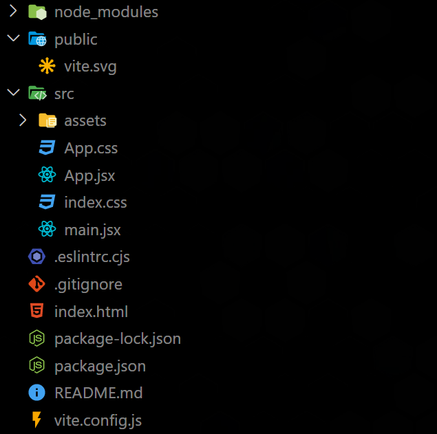

# 🎓 Vite Js + React Basic to Advance

## 🔺 Install vite

```
npm create vite@latest 
```

- Enter your project name.
- Select react
- Select JavaScript Only

```bash
cd myProject
```

```bash
npm install
```

```bash
npm run dev
```

****
****
**Open vs code in this directory**

```bash
PS C:\Users\Desktop\myProject> code .
```

- **folder structure :**



- `public` : public directory for show publicly show.
- `src` : the *src* is source directory. this not show publicly.
- `main.jsx` : This file is return all components.
- `App.jsx` : write here hello world.
- `package.json` & `package-lock.json` : **Warning** do not change anything in this file end do not delete this file. this files handle all dependence's end all packages.

****
****